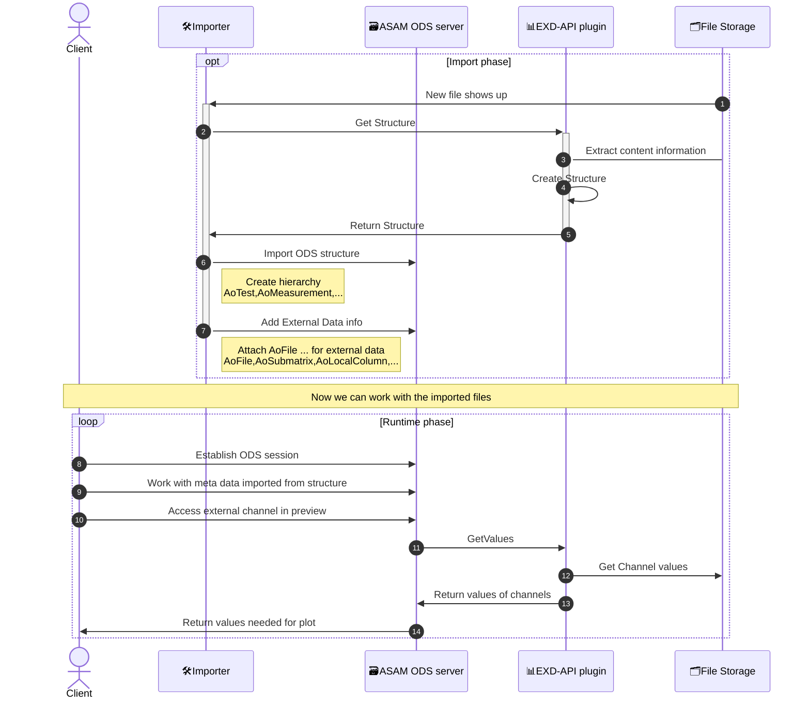

# ASAM ODS EXD-API microUniDAQ plugin

This repository contains a [ASAM ODS EXD-API](https://www.asam.net/standards/detail/ods/) plugin that uses [h5py](https://pypi.org/project/h5py/) to read microUniDAQ HDF5 waveform files.

It is built on the [ods-exd-api-box](https://pypi.org/project/ods-exd-api-box/) helper library which provides the gRPC server infrastructure and proto stubs.

## Content

### Implementation
* [external_data_file.py](external_data_file.py)<br>
  Implements the `ExdFileInterface` from `ods-exd-api-box` to access microUniDAQ HDF5 files using [h5py](https://pypi.org/project/h5py/).
  Also contains the entry point to run the gRPC service.

### Tests
* [test_exd_api.py](tests/test_exd_api.py)<br>
  Some basic tests on example files in `data` folder.

## Development

### Setup

Install [uv](https://docs.astral.sh/uv/) and then install the project with dev dependencies:

```
uv sync --group dev
```

### Run Tests

```
uv run python -m unittest discover tests
```

### Code Quality

```bash
uv sync --group dev                    # 1. Install all dependencies
uv run ruff format .                   # 2. Format code
uv run ruff check --fix .              # 3. Fix lint violations
uv run mypy external_data_file.py      # 4. Type check
uv run python -m unittest discover tests  # 5. Run tests
```

## Docker

### Docker Image Details

The Docker image for this project is available at:

`ghcr.io/peak-solution/asam-ods-exd-api-microunidaq:latest`

This image is automatically built and pushed via a GitHub Actions workflow. To pull and run the image:

```
docker pull ghcr.io/peak-solution/asam-ods-exd-api-microunidaq:latest
docker run -v /path/to/local/data:/data -p 50051:50051 ghcr.io/peak-solution/asam-ods-exd-api-microunidaq:latest
```

### Using the Docker Container

To build the Docker image locally:
```
docker build -t asam-ods-exd-api-microunidaq .
```

To start the Docker container:
```
docker run -v /path/to/local/data:/data -p 50051:50051 asam-ods-exd-api-microunidaq
```

have a look at [start options](https://totonga.github.io/ods-exd-api-box/server-options.html) to
figure out how to customize the behavior of the EXD-API plugin.

## Architecture and Usage in ODS Server


